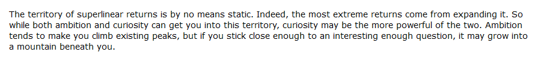
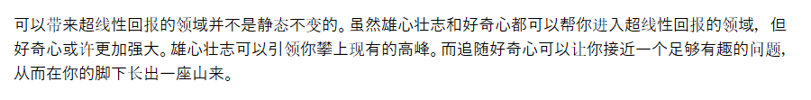
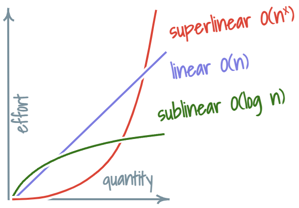
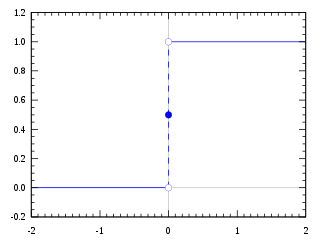
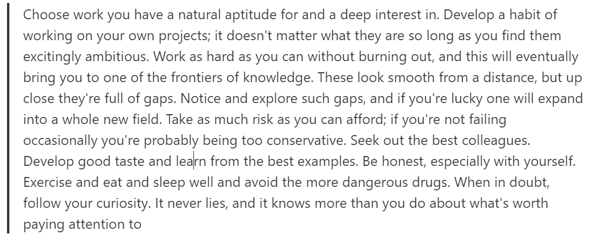
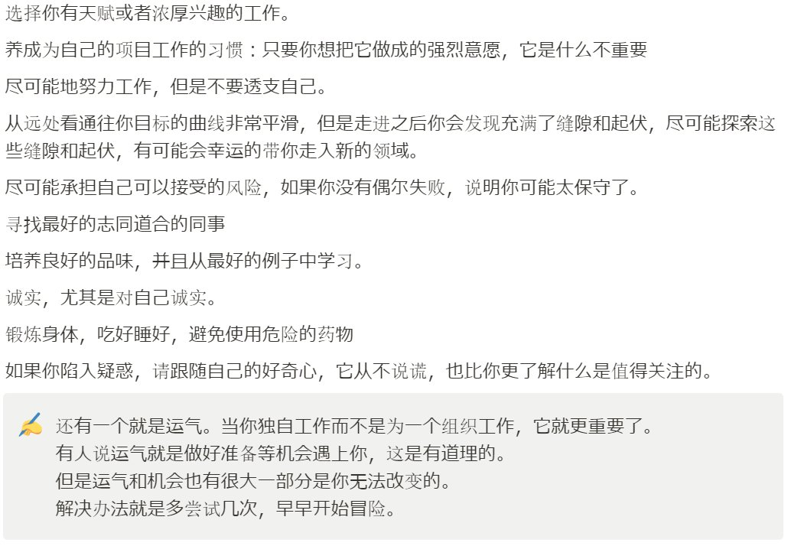
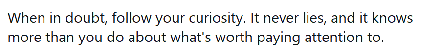
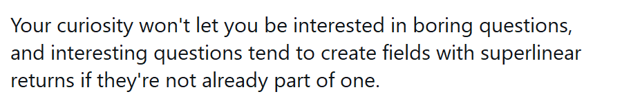

## 前言

Paul Graham写了一篇长文《Superlinear Returns》，在文中他想阐释这样一个观点：虽然我们从小常被教育"一分耕耘一分收获"，但是很显然在现实生活中很多领域里，努力和回报并不是线性的，而是超线性的。

这篇文章我读了几遍，消化了很久，一直想分享又没有整理好自己的思路。接下来我只分享的只是我对这篇文章的理解，不代表原作者的观点。

## 什么是超线性回报？

> The returns for performance are superlinear.

表现所带来的回报是超线性的。我们都被教导一分耕耘一分收获，越努力越幸福。但是现实生活中，这样线性的回报原理并不总成立。如果你的产品只有竞争对手一半好，通常来说你不会获得一半的用户，而是会几乎做不下去这个生意。常见的是赢者通吃。

### 超线性回报的两个基本成因

#### 1. 指数增长（Exponential Growth）
从事可以带来指数成长的事，可以带来超线性回报。什么是可以带来指数成长的事？

> Whenever how well you do depends on how well you've done, you'll get exponential growth.

这句我不知道如何翻译是好🥲

#### 2. 阈值（Thresholds）
阈值这个概念理解起来有些Tricky。这里指的是阶跃函数里的阈值。阶跃函数是一种激活函数，以阈值为界，小于等于阈值时输出0，大于阈值时输出1。数学上来说，阶跃函数并不是超线性的。但是在描述一个人的努力和回报的超线性关系时常常是适用的，常常在一个关键节点之前，我们几乎看不到什么回报。

## 如何获取超线性回报？

### 持续学习的力量

寻找超线性回报的一般原则就是`seek work that compound`。而学习就是一个非常好的例子。我认为作者这里想说的学习，不光是学习知识，也是在失败中学习成长的意思。原文有这样一句：

> Always be learning. If you're not learning, you're probably not on a path that leads to superlinear returns.

#### 关于学习内容的选择
不要过度优化自己学习的内容。我们不应该限制自己只去学习已知有价值的东西。因为我们还在学习，没人能预测接下来什么会是有价值的。如果你太过挑剔要求自己学习的内容必须是有价值的，那你有可能会剔除那些真的可以带来超线性回报的不同寻常的事物（outliers）。

### 追随好奇心的重要性

"你的好奇心不会让你对无趣的问题感兴趣，而有趣的问题最后都会创造出拥有超线性回报的领域（如果他们还不是现存的）。"

"如果你陷入困惑和怀疑，请跟随自己的好奇心，它从不说谎，它也比你更了解什么是值得关注的。"

如文章结尾所说："雄心可以助你攀上现有的高峰。可追随好奇心可以让你接近一个足够有趣的问题，在你的脚下长出一座山来。"

### Work与Job的区别

文中还有一个我非常喜欢的观点。他说Work 不等于 Job。虽然这两者的中文翻译都是工作，但是：

- Work可以定义为：`something created as a result of effort, especially a painting, book, or piece of music`
- Job的定义通常就很简单：`the regular work that a person does to earn money`

在过去，这两者通常都是相同的。但对于作家，艺术家，科学家来说，work意味着他们正在研究或者创造的东西。如果他们有一个job title，那么他们的work就是他们会从一个job带到另一个job的东西。

回到英语里的灵魂提问"So What do you do?"，我希望有一天我可以给出我的Job title以外的回答。

## 现代社会中的超线性回报

### 技术进步带来的新机遇

得益于过去50年来的技术进步，组织的重要性不断下降，超线性回报出现在越来越多的领域。人们不再需要依附于某个组织获取资源就可以获取充足的资源，找到志同道合的朋友，不断地试错学习。准确的来说每个人都应该获得超线性回报，因为学习可以产生复利，而人的一生都应该保持学习。

### 超线性回报的两面性

在超线性回报的模型里，做得好的人会做得更好，做的不好的人会表现得更加糟糕。所以并不是每个人都适合超线性回报，也不是每个人都喜欢这个趋势。超线性回报必然带来一定程度上的不平等。旧模型里的既得利益者也并不喜欢自己的蛋糕变小。

### 现代陷阱的警示

#### 线性思维的局限
关于获得正反馈也许有时候我们走入了一个死胡同。现代社会最常见的正反馈就是金钱，而打工是最容易获得线性金钱回报作为正反馈的事情。我们常常陷入这种线性回报带来的安全感里无法脱身，过上日复一日没有进步的生活。因此无法去探索那些可以真的产生复利，带来超线性回报的事情。

#### 社交媒体的误区
社交媒体是现在很容易产生超线性汇报的一个领域，但是社交媒体又用数据创造了一个即时回报的系统给用户。提高用户的粘性，创造当下的"正反馈"。但是等我们被流量所训练而不自知的时候，创造出大量迎合算法的内容。日复一日的追热点留下的只不过是容易过时的垃圾。而你创造的东西终归会变成你。

## 结语

知道了原来努力和回报并不是线性的，并不是一份耕耘一份收获很多人都会感到很沮丧。但我认为这个理论反而说服了我追求自己的好奇心，去做那些当下也许并不能立刻带来什么世俗回报的事。让我转变mindset去拥抱长期主义去成长，去学习，而不是纠结当下的一点得失。